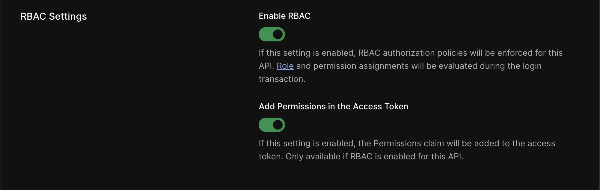
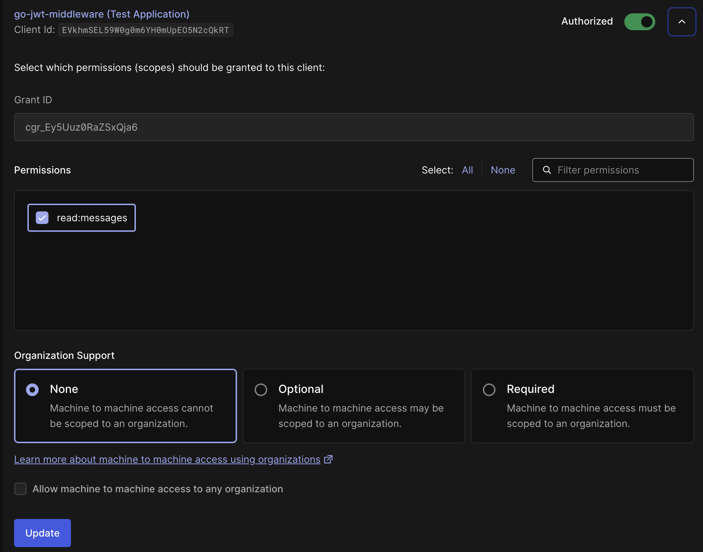

# Auth0 Golang API Sample - Authorization (RS256)

This sample demonstrates how to protect a Go API using Auth0 with RS256 signed JWT tokens.

## Prerequisites

- Go 1.24 or higher
- An Auth0 account ([Sign up for free](https://auth0.com/signup))

## Setup

1. **Create an API in Auth0 Dashboard:**
   - Go to APIs in your Auth0 Dashboard
   - Click "Create API"
   - Give it a name and identifier (audience)
   - Select RS256 signing algorithm

2. **Add permissions to your API:**
   - Select your API in the Auth0 Dashboard
   - Go to the **Permissions** tab
   - Add a new permission:
     - **Permission (Scope):** `read:messages`
     - **Description:** Read messages from the API
   - Click **Add**

3. **Enable RBAC for your API (Important!):**
   - Select your API in the Auth0 Dashboard
   - Go to the **Settings** tab
   - Scroll down to **RBAC Settings**
   - Enable **Enable RBAC**
   - Enable **Add Permissions in the Access Token**
   - Click **Save**
   
   
   
   > ⚠️ **Note:** Without enabling these settings, the `permissions` array in your access token will be empty, causing the scoped endpoint to fail with a 403 error.

4. **Configure Machine-to-Machine Application (for testing):**
   - Go to **Applications > Applications** in your Auth0 Dashboard
   - Select your Machine-to-Machine application (or create one)
   - Go to the **APIs** tab
   - Find your API and expand it
   - Toggle **Authorize** to enable it
   - Select the permissions you want to grant (e.g., `read:messages`)
   - Click **Update**
   
   
   
   > 💡 This step ensures that tokens generated for this application will include the selected permissions in the `permissions` array.

5. **Configure environment variables:**
   ```bash
   cp .env.example .env
   ```
   
   Edit `.env` and set:
   ```
   AUTH0_DOMAIN=your-tenant.auth0.com
   AUTH0_AUDIENCE=https://your-api-identifier
   ```

6. **Install dependencies:**
   ```bash
   go mod download
   ```

## Running the Sample

```bash
go run cmd/server/main.go
```

The server will start on port 8080.

## API Endpoints

### Public Endpoint (No Authentication Required)
```bash
curl http://localhost:8080/api/public
```

### Private Endpoint (Requires Valid JWT)
```bash
curl -H "Authorization: Bearer YOUR_ACCESS_TOKEN" \
     http://localhost:8080/api/private
```

### Scoped Endpoint (Requires JWT with `read:messages` scope)
```bash
curl -H "Authorization: Bearer YOUR_ACCESS_TOKEN" \
     http://localhost:8080/api/private-scoped
```

## Getting an Access Token

To test the protected endpoints, you need an access token:

1. Go to the **Test** tab of your API in the Auth0 Dashboard
2. In the **Scopes** field, add `read:messages` (for testing the scoped endpoint)
3. Copy the provided access token or `curl` command
4. Use it in the `Authorization` header as shown above

**Note:** Tokens without the `read:messages` scope will receive a 403 Forbidden error when accessing the scoped endpoint.

### Verifying Your Token Contains Permissions

You can decode your JWT token at [jwt.io](https://jwt.io) to verify it contains the permissions. A properly configured token should include:

```json
{
  "iss": "https://your-tenant.auth0.com/",
  "sub": "...",
  "aud": "https://your-api-identifier",
  "iat": 1697988893,
  "exp": 1698075293,
  "azp": "...",
  "scope": "read:messages",
  "gty": "client-credentials",
  "permissions": [
    "read:messages"
  ]
}
```

If the `permissions` array is empty, please verify you've completed steps 3 and 4 in the Setup section above.

## Project Structure

```
01-Quickstart-Go-API/
├── cmd/
│   └── server/
│       └── main.go          # Application entry point
├── internal/
│   ├── auth/
│   │   ├── validator.go     # JWT validator setup
│   │   └── middleware.go    # JWT middleware
│   ├── config/
│   │   └── auth.go          # Configuration loading
│   └── handlers/
│       └── api.go           # HTTP handlers
├── .env.example
├── go.mod
└── README.md
```

## Key Features

- ✅ RS256 JWT validation
- ✅ Custom claims support
- ✅ Scope-based authorization
- ✅ Graceful shutdown
- ✅ Production-ready timeouts
- ✅ Structured logging with slog

## Learn More

- [Auth0 Go SDK Documentation](https://github.com/auth0/go-jwt-middleware)
- [Auth0 Documentation](https://auth0.com/docs)
- [Securing Go APIs with 
## Project Structure

```
01-Autckstart/backend/golang)

## License

This project is licensed under the MIT license. See the [LICENSE](../../LICENSE) file for more info.
